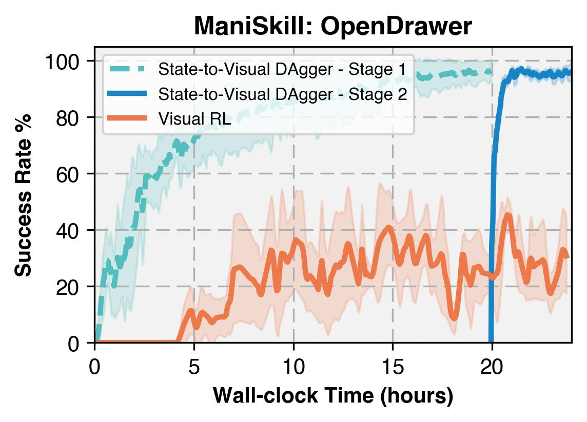
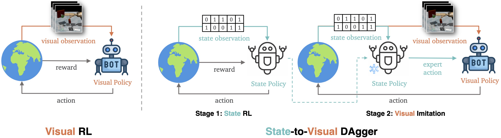

<h1>s2v DAgger</span></h1>

Official implementation of

[When Should We Prefer State-to-Visual DAgger Over Visual Reinforcement Learning?](TBD) by

[Tongzhou Mu](https://cseweb.ucsd.edu/~t3mu/)\*, Zhaoyang Li\*, Stanisław Wiktor Strzelecki\*, Xiu Yuan, Yunchao Yao, [Litian Liang](https://www.litianliang.org/), [Hao Su](https://cseweb.ucsd.edu/~haosu), (UC San Diego)</br>

</br>

----

## Overview

Visual RL is a promising approach that directly trains policies from visual observations, although it faces challenges in sample efficiency and computational costs. We conduct an empirical comparison of State-to-Visual DAgger — a two-stage framework that initially trains a state policy before adopting online imitation to learn a visual policy — and Visual RL across a diverse set of tasks. 


<br/>

We evaluate both methods across 16 tasks from three benchmarks, focusing on their asymptotic performance, sample efficiency, and computational costs. Surprisingly, our findings reveal that State-to-Visual DAgger does not universally outperform Visual RL but shows significant advantages in challenging tasks, offering more consistent performance. In contrast, its benefits in sample efficiency are less pronounced, although it often reduces the overall wall-clock time required for training. 


----

## Installation

Install all dependencies via `mamba` or `conda` by running the following command:

```bash
mamba env create -f environment.yml
mamba activate s2v
```

Note: `mamba` is a drop-in replacement for `conda`. Feel free to use `conda` if you prefer it.


----


## Run Experiments

State-to-Visual DAgger has two stages:
- **Stage 1:** Learning State Policy by RL.
- **Stage 2:** Learning Visual Policy by DAgger.


### Stage 1: Learning State Policy by RL

The following commands should be run under the repo root dir.

```bash
python scripts/state_sac_adroit.py --env-id AdroitHandHammer-v1

python scripts/state_sac_adroit.py --env-id AdroitHandPen-v1

python scripts/state_sac_adroit.py --env-id AdroitHandRelocate-v1 --total-timesteps 80_000_000 --reward-scale 1 
```

Note: 
- If you want to use [Weights and Biases](https://wandb.ai) (`wandb`) to track learning progress, please add `--track` to your commands.

### Stage 2: Learning Visual Policy by DAgger

The following commands should be run under the repo root dir.

```bash
python scripts/s2v_dagger_adroit.py --env-id AdroitHandHammer-v1 --expert-ckpt STATE_POLICY_CHECKPOINT_FROM_STAGE_1

python scripts/s2v_dagger_adroit.py --env-id AdroitHandPen-v1 --expert-ckpt STATE_POLICY_CHECKPOINT_FROM_STAGE_1

python scripts/s2v_dagger_adroit.py --env-id AdroitHandRelocate-v1 --expert-ckpt STATE_POLICY_CHECKPOINT_FROM_STAGE_1 --total-timesteps 40000000

```

----

## Citation

If you find our work useful, please consider citing our paper as follows:

```
@inproceedings{mu2025when,
  title={When Should We Prefer State-to-Visual DAgger Over Visual Reinforcement Learning?},
  author={Mu, Tongzhou and Li, Zhaoyang and Strzelecki, Stanisław and Yuan, Xiu and Yao, Yunchao and Liang, Litian and Su, Hao},
  booktitle={Proceedings of the AAAI Conference on Artificial Intelligence},
  year={2025}
}
```

----

## Acknowledgments

This codebase is built upon [CleanRL](https://github.com/vwxyzjn/cleanrl) repository.

## License

This project is licensed under the MIT License - see the `LICENSE` file for details. Note that the repository relies on third-party code, which is subject to their respective licenses.